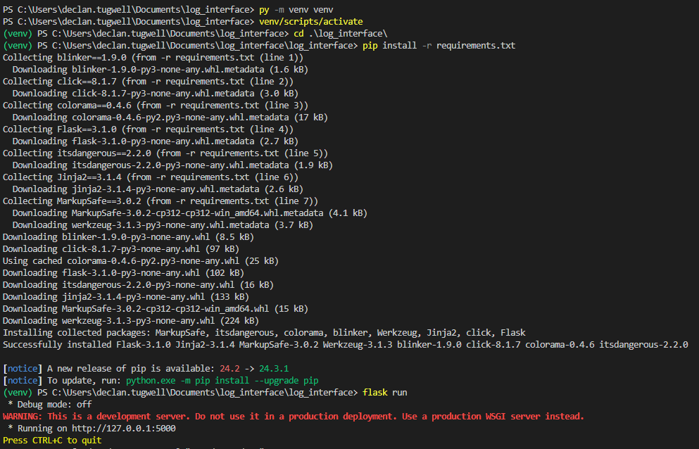

# Readme.md

*This is for a Uni assignment - **security** was **not** much of a factor*

## Application Setup

### Required Software

In order to run the application you must have

- The latest [version of Visual Studio Code](https://code.visualstudio.com/download) installed
- The latest [version of python](https://www.python.org/downloads/) installed

### Setup steps

1. Open Visual Studio Code
2. Open the parent folder of "log_interface" in visual studio code (The parent folder may be "log_interface" depending on how you have unzipped the folder)
3. Open a terminal within visual studio (Terminal -> New Terminal)
4. Enter `py -m venv venv` into the terminal
5. Enter `venv/scripts/activate` into the terminal
6. Change the terminal directory by entering `cd .\log_interface\` into the terminal
7. Install the required packages using `pip install -r requirements.txt`
8. Run the application be entering `flask run` into the terminal

Following these steps should produce the following output in the terminal



Loading the `http://127.0.0.1:5000` webpage will allow you to access the application.

### Accounts

The application currently has a seeded database that contains 5 different test accounts.
The credentials for each account are as follows:

Username: `admin`
Password: `admin123`

Username: `andrew`
Password: `password`

Username: `benjamin`
Password: `password`

Username: `marcus`
Password: `password`

Username: `isolde`
Password: `password`

Username: `declan`
Password: `password`

Username: `matt`
Password: `password`

Username: `trinity`
Password: `password`

Username: `jason`
Password: `password`

Username: `jenson`
Password: `password`

## API Endpoints

The application contains API endpoints for integrating with other applications.
These endpoints are used to manipulate log entries within the log table of the database.
Below are each of the endpoints as well as an example of how to interact with them.

## Creating a log

Creates a record within the log table, associating it with a specific project from the project table using the project_id

#### Endpoint format

```url
http://127.0.0.1:5000/create_log
```

#### Example

```bash
curl -X POST http://127.0.0.1:5000/create_log -H "Content-Type: application/json" -d '{ "message" : "Test Request", "logType" : 0, "timestamp" : "", "projectId" : 1 }'
  ```

## Deleting logs

Deleted a record from the log table based on the log_id

#### Endpoint format

```url
http://127.0.0.1:5000/delete_log/{log_id}
```

#### Example

```bash
curl -X DELETE http://127.0.0.1:5000/delete_log/4 -H "Content-Type: application/json"
```

## Fetching logs for a project

Fetches all records from the log table that are associated with a project.

#### Endpoint format

```url
http://127.0.0.1:5000/get_logs/{project_id}
```

#### Example

```bash
curl -X GET http://127.0.0.1:5000/get_logs/1 -H "Content-Type: application/json"
```

## Updated log type

Updates the log_type value of a record within the log table

#### Endpoint format

```url
http://127.0.0.1:5000/update_log_type/{log_id}
```

#### Example

```bash
curl -X UPDATE http://127.0.0.1:5000/update_log_type/4 -H "Content-Type: application/json" -d '{ "logType" : 2 }'
```
